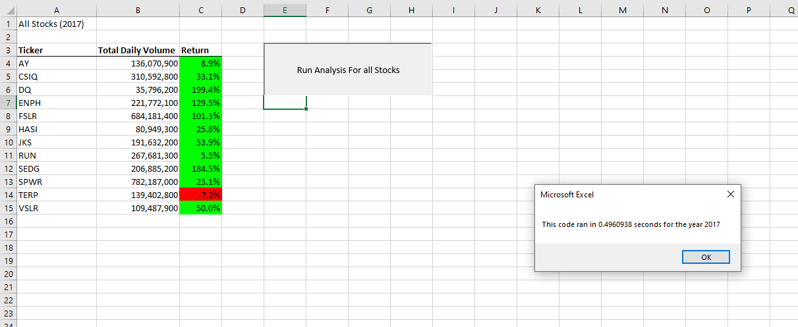
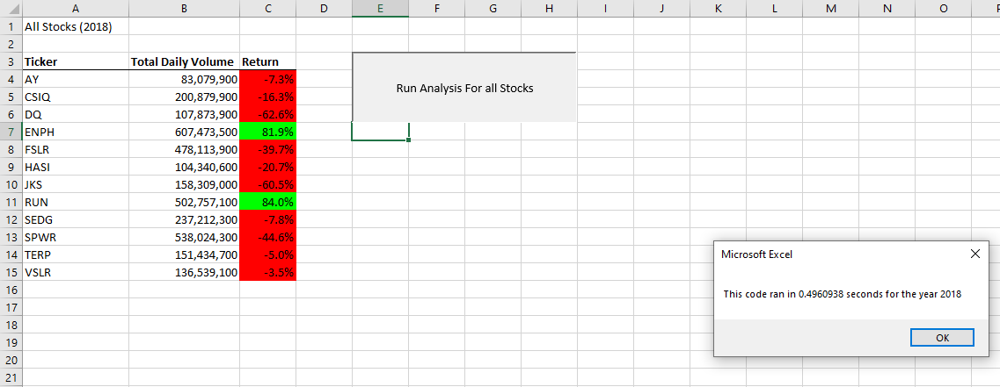

# Stock-Analysis
 Module 2 stock analysis

## Overview of Stock Analysis
 For this module I was given documents containing stocks and there overall outcomes from the years 2017, and 2018. From there the customer asked that I compress the data and make a workbook so he can sort through the two years of stocks he proivided and see the best/ worst overall outxcomes and trends. It is important to make this workbook very accessible and easy to use as the customer is planning on using it to help his parents plan there future investments. Below I have included the results and findings also attached are photos of my results.

## Results and Findings 
 Some intertesting results when pulling and organizing the data set given to me was the difference in trade volume daily. 2017 for example HASI and DQ had some of the lowest trade volume but still came out with a positive rerturn rate. Unfortunately wwith those two same stocks(HASI, DQ) in 2018 the daily trade volume grew esponetially but the return in the end was negative for both. Infact in 2018 compared to 2017 total daily trade volume for all stocks raised quite a bit, but only two stocks came out with a positivew return rate(ENPH, RUN). In all I found it very interesting that in 2017 more than most stocks at the end of the year finished with a positive return rate, but the following year with a higher average daily trade volume most stocks seemed to suffer.
 
 
 
 ## Summary
  1. Disadvantages/Advantages of Refactoring code: 
     - A couple advantages that I noticed while working through this data set was that when refactoring code it seemed to help find bugs and defintely sped up the process of pragramming/ improved the overall quality. 
     - For disadvantages it seems that it does take more time and if time is of the essance I can see it not being as viable especially with bigger applications. 
  2. Pros and Cons of applying refactoring to the original VBA Script
     - Pros that immidietley come to mind is reducing the amount of loops in the code. Hence making the process a bit faster. Also refactoring fro mthe original and making small changes here and there defintely sped up the process and made it to where I was much more time efficient. 
     - Cons I can think of include its future proofing of the product or file in the sense that it might not be very accessible in other programs and will then have to be rewritten completely in the end. 
